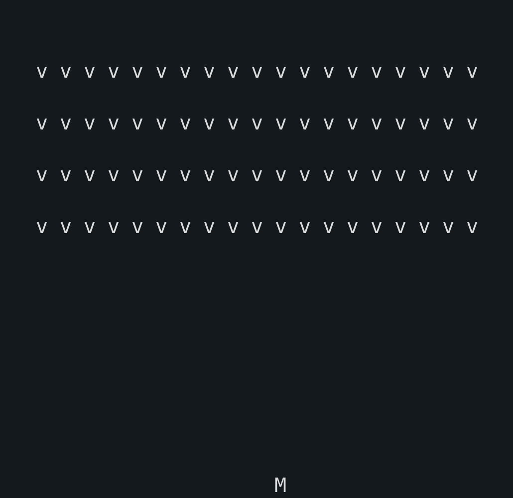

# Space Invaders - Rust Game

A terminal-based Space Invaders game built in Rust, demonstrating core game development concepts and Rust programming patterns.

## Overview

This project implements a classic Space Invaders game that runs in the terminal. Players control a spaceship at the bottom of the screen, moving left and right to avoid enemy fire while shooting down descending invaders.

The game is developed through the course [Udemy: Ultimate Rust Crash Course](https://www.udemy.com/certificate/UC-024eb582-6ab8-4d58-92a2-395a190d6765/) with extra improvements and code organization.

## Gameplay

- **Controls:**
  - `←` / `→` - Move left/right
  - `SPACE` / `ENTER` - Shoot
  - `ESC` / `q` - Exit game

- **Objective:** Defeat all invaders before they reach the bottom of the screen

## Game Preview



## Key Concepts & Technologies

### 1. **Game Loop Architecture**
- Frame-based update system using delta time (`Instant::elapsed()`)
- Continuous rendering and input polling
- Time-managed game state updates for smooth gameplay

### 2. **Object-Oriented Design with Traits**
- **`Drawable` trait**: Defines a common interface for all renderable game objects
  - Enables polymorphic rendering across different entity types
  - Player, Invaders, and Shots all implement `Drawable`
- **`Tickable` trait**: Standardizes time-based state updates for game entities
  - Provides consistent interface for delta-time updates
  - Returns a boolean to indicate entity lifecycle (alive/dead)
  - Game timing semantics: idiomatic Rust naming for time-stepped updates
- Clean separation of concerns through trait-based design patterns

### 3. **Struct-Based Composition**
- **`Player`**: Manages player position, movement, and shots
- **`Invaders`**: Manages enemy state, movement patterns, and wave management
- **`Frame`**: 2D grid buffer for rendering
- **`Display`**: Handles terminal rendering and screen management
- **`Shot`**: Represents projectiles with collision tracking

### 4. **Input Handling**
- Non-blocking keyboard input using `crossterm::event`
- Command enumeration (`GameCommand`) for clean action dispatch
- Support for multiple input types (arrow keys, space, escape)

### 5. **Concurrent Rendering**
- **Multi-threaded architecture**: Separates game logic from rendering
- **Message Passing**: Uses `std::sync::mpsc` channels for thread communication
- **Frame Buffering**: Prevents tearing through double-buffering pattern
- Main thread handles game logic; dedicated thread manages display updates

### 6. **Audio System**
- Integration with `rusty_audio` library
- Sound effects for player actions (shooting, explosions, lose/win states)
- Non-blocking audio playback during gameplay

### 7. **Terminal Manipulation**
- `crossterm` library for cross-platform terminal API
- Raw mode terminal input processing
- Cursor hiding and alternate screen buffer usage
- Clean terminal state management on exit

### 8. **Collision Detection**
- Hit detection between player shots and invaders
- Boundary checking for player movement and invader progression
- Win/lose condition evaluation

### 9. **Game State Management**
- Structured game state with clear ownership models
- Mutable state updates following Rust's borrowing rules
- Event-driven architecture with command patterns

### 10. **Time Management**
- Frame rate control using time intervals
- Consistent gameplay speed across different systems
- Time-based animation updates using `rusty_time`

## Dependencies

- **`crossterm`** (v0.17.5): Terminal manipulation and raw input handling
- **`rusty_audio`** (v1.1.4): Audio playback for sound effects
- **`rusty_time`** (v0.11.0): Time utilities for game timing

## Testing

The project includes comprehensive unit tests for core components:
- **Shot Structure**: 12 unit tests covering:
  - Entity creation and initialization
  - Time-based movement and position updates
  - Collision and explosion states
  - Rendering with different visual states
  - Boundary conditions and edge cases

Run tests with:
```bash
cargo test
```

## Learning Outcomes

This project demonstrates:
- Rust ownership and borrowing principles
- Trait-based polymorphism and abstraction
- Multi-threaded programming with channels
- Game loop pattern and time-delta updates
- Clean architecture and separation of concerns
- Cross-platform terminal application development
- Enum-based state and command patterns
